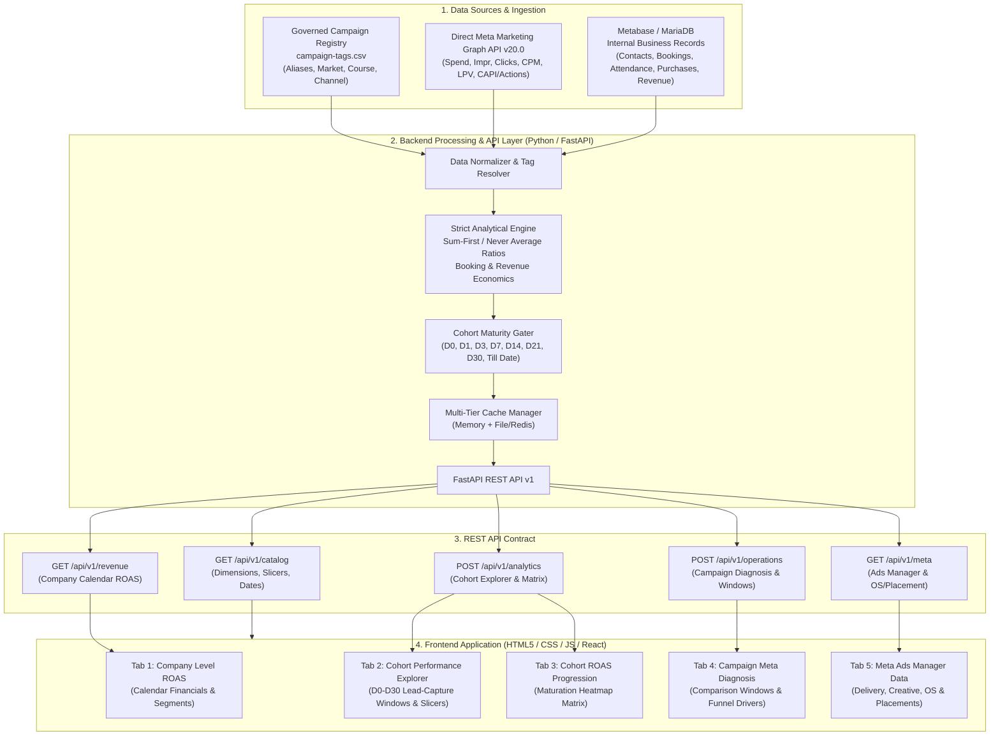

# Bambinos Marketing & Cohort Analytics Dashboard
## Master Architecture Design & Step-by-Step Execution Roadmap

> **Status:** Active Reference & Progress Tracker  
> **Target Version:** v14 Production Standard (Direct Meta Marketing Graph API v20.0 Delivery & Metabase Internal Business Truth)

---

## 1. System Architecture & High-Level Design

### 1.1 Architecture Diagram

---

### 1.2 Dual-Source Truth Contract

| Metric / Dimension Domain | Source of Truth | Key Metrics / Fields | Ingestion & Attribution Rule |
|---|---|---|---|
| **Meta Ad Delivery** | **Windsor.ai** (Meta API) | Spend, Impressions, CPM, Link Clicks, Link CTR, Landing Page Views (LPV), Click→LPV %, Cost per Result | Grain: `account_id, date, ad_id, impression_device, placement`. Spend and delivery remain fixed at Day 0 (D0). |
| **Internal CRM & Funnel** | **Metabase / DB** (Internal logs) | Unique Contacts, Demos Booked, Booked·Held, Booked·Attended, Attendance %, Conversions, Lead→Paid % | Leads permanently belong to their capture date cohort. Outcomes accumulate as cohorts age through D1, D3, D7, D14, D21, D30, Till Date. |
| **New Business Revenue** | **Metabase / DB** (Governed `new_revenue`) | `new_revenue`, ARPU, New-Business ROAS, Revenue per Demo Booked | Governed `new_revenue` (never first-time-only). Calendar view uses invoice date; Cohort view uses lead-capture date. |
| **Meta Conversion Events** | **Windsor.ai CAPI / Pixel** | `CompleteRegistration`, `StartTrial`, `Subscribe`, `Purchase` | User chooses explicit booking signal (`CompleteRegistration` OR `StartTrial`). Never summed together to avoid double-counting. |
| **Campaign Tagging & Taxonomy** | `campaign-tags.csv` | Canonical Display Name, Course, Market/Country, Channel | Exact matching after normalization. Unmatched campaigns become `Unmapped` (never silently merged into `Others`). |

---

## 2. Core Business Logic & Metric Formulas

### 2.1 The Cardinal Law: "Never Average Ratios"
Every ratio and unit metric across the dashboard is calculated **strictly from summed numerators and summed denominators** after all filters and groupings have been applied:
- **ROAS**: `Sum(New Revenue) / Sum(Spend)`
- **Cost per Demo Booked**: `Sum(Spend) / Sum(Demos Booked)`
- **Revenue per Demo Booked**: `Sum(New Revenue) / Sum(Demos Booked)`
- **Attendance %**: `(Sum(Demos Attended) / Sum(Demos Booked)) * 100`
- **Lead Conversion %**: `(Sum(Conversions) / Sum(Contacts Registered)) * 100`

### 2.2 Maturity Gating
For any cohort window $D_n$ (e.g., $D_7$):
- A lead capture date is included **only if** $\text{Capture Date} + n \le \text{Latest Refresh Date}$.
- Incomplete cohort windows are excluded so that conversion curves do not artificially drop off.

---

## 3. Current State vs. Target State (Gap Analysis)

| Feature / Module | Current Codebase Status | Target v14 Production Standard | Status |
|---|---|---|---|
| **Tab 1: Company Level ROAS** | Fully integrated in UI | Integrated calendar revenue vs spend, segment filters (India/Intl, Courses), monthly/daily grid, composed charts | `[x]` Completed |
| **Tab 2: Cohort Explorer** | Fully integrated in UI | Full hierarchical slicing (Account, Campaign, AdSet, Ad, Market, Course, Traffic), dynamic metric toggles, CSV export | `[x]` Completed |
| **Tab 3: ROAS Progression Heatmap** | Fully integrated in UI | Full dynamic date vs. $D_n$ matrix with metric picker (`new_roas`, `lead_conversion`, `demos_attended`, `new_revenue`) and HSL gradient scale | `[x]` Completed |
| **Tab 4: Campaign Meta Diagnosis** | Fully integrated in UI | Interactive Comparison Windows (e.g., Last 7D vs Prev 7D, MoM), automated driver decomposition & funnel bottleneck diagnostic | `[x]` Completed |
| **Tab 5: Meta Ads Manager View** | Fully integrated in UI | Dedicated ad delivery analytics with Device OS (iOS/Android/Desktop) and Ad Placement breakdown | `[x]` Completed |
| **Backend API Contract** | Modular endpoints ready | Unified `/api/v1/` contract (`catalog`, `revenue`, `analytics`, `operations`, `quality`) with multi-tier caching | `[x]` Completed |
| **Campaign Tagging Governance** | Registry loaded & indexed | Strict `campaign-tags.csv` registry parser with alias normalization and `Unmapped` safety fallback | `[x]` Completed |

---

## 4. Step-by-Step Implementation Roadmap

### Phase 1: Metric Contract & Calculation Engine Core
- [x] **Step 1.1**: Define strict metric formulas (`cost_per_demo_booked`, `revenue_per_demo_booked`, `new_roas`, sum-first unit ratios).
- [x] **Step 1.2**: Implement cohort maturity gating logic ($D_n \le \text{Refresh Date}$).
- [x] **Step 1.3**: Integrate campaign tagging registry parser (`campaign-tags.csv`) with alias resolution and case/whitespace normalization.
- [x] **Step 1.4**: Implement Meta conversion event mapping (`CompleteRegistration`, `StartTrial`, `Subscribe`, `Purchase`) with strict anti-double-counting logic.

### Phase 2: Backend API Architecture (FastAPI)
- [x] **Step 2.1**: Set up modular router structure under `backend/app/api/v1/`.
- [x] **Step 2.2**: Implement `GET /api/v1/catalog` returning filter dimensions, date bounds, cohort periods, and tagging hierarchy.
- [x] **Step 2.3**: Implement `GET /api/v1/revenue` providing company calendar facts, monthly summaries, and market/course segment breakdowns.
- [x] **Step 2.4**: Implement `POST /api/v1/analytics` handling multi-dimensional grouping, filtering, cohort window selection, and totals computation.
- [x] **Step 2.5**: Implement `POST /api/v1/operations` supporting comparison windows (Period A vs Period B) and root-cause driver decomposition.
- [x] **Step 2.6**: Multi-tier caching with TTL invalidation and resilient fallback on database timeout.

### Phase 3: Frontend Interface & 5-Tab Architecture
- [x] **Step 3.1**: Base layout and executive KPI cards styling.
- [x] **Step 3.2**: **Tab 1: Company Level ROAS** — Calendar grid, financial summary cards, market/course segment comparison, composed charts.
- [x] **Step 3.3**: **Tab 2: Cohort Performance Explorer** — Multi-select dropdowns, hierarchical ad drill-down, metric column switchers (Core vs All), and CSV export.
- [x] **Step 3.4**: **Tab 3: Cohort ROAS Progression** — Heatmap matrix displaying capture dates vs cohort maturity periods ($D_0$ through Till Date) with dynamic HSL color styling.
- [x] **Step 3.5**: **Tab 4: Campaign Meta Diagnosis** — Comparison window selector (7D, 14D, 30D, Custom), metric trend charts, and funnel leak diagnosis.
- [x] **Step 3.6**: **Tab 5: Meta Ads Manager Data** — Delivery KPIs, Device OS breakdown (iOS, Android, Desktop), Placement analysis, and Meta Result event selector.

### Phase 4: Data Governance, Ingestion & Automated Pipelines
- [x] **Step 4.1**: Direct Meta Marketing Graph API ingestion engine with chunked batching and inter-batch micro-throttling (`ingest_meta_direct.py`, `00_create_staging_tables.sql`).
- [x] **Step 4.2**: Database synchronization scripts for MariaDB materialized cohort cache (`sync_cohort_cache.py`).
- [x] **Step 4.3**: Daily automated refresh workflow (`daily-marketing-sync.yml` & `deploy_marketing_job.sh`) running at 08:00 AM IST with checksum verification (`verify_reconciliation.py`).

### Phase 5: Verification, Quality Control & Production Readiness
- [x] **Step 5.1**: Unit tests verifying booking economics, ratio recalculation, and zero-booking edge cases (`test_v14_engine.py`).
- [x] **Step 5.2**: Reconciliation tests matching company calendar totals and cohort sums (`verify_reconciliation.py`).
- [x] **Step 5.3**: Unit test suite for Direct Meta ingestion and Cohort Cache sync (`test_meta_ingest.py`, `test_cohort_sync.py`).
- [x] **Step 5.4**: Production deployment scripts (`deploy_marketing_job.sh`, `.github/workflows/daily-marketing-sync.yml`).

---

## 5. How to Track Progress

- Every completed item in this file is marked with `[x]`.
- Active tasks in development are marked with `[/]`.
- Upcoming tasks are marked with `[ ]`.
- This document serves as the single source of truth for engineering progress and architectural integrity.
